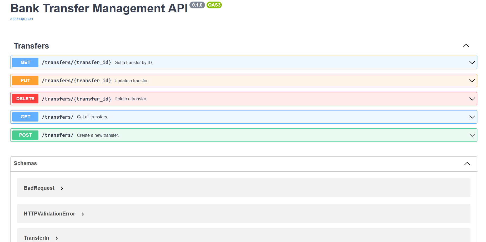

# Transfer Management REST API Application

## About

> Using **Python** (FastAPI, SQLAlchemy, Pytest)

**Includes:**
- Models in the database created using SQLAlchemy
- Endpoints for: get all transfers, get a transfer by ID, delete a transfer, create a new transfer, update a transfer.
- While retriving all transfers you can optionally, filter them by specified query parameters.
- Python Docstrings
- Integration tests using fastapi.TestClient

#

## Installation
> `git clone ...`\
`pip install -r requirements.txt`

#

## Try it out
> `uvicorn transfer_management_app.main:app`

Go on 127.0.0.1:8000/docs

#

## Run Tests?
> `pytest --cov`
